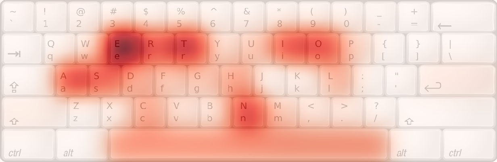
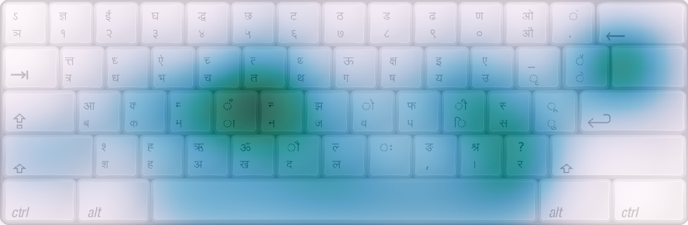

# Keyboard Heatmap

This project helps create heatmap of keys in keyboard for some given text.

Supports Nepali `नेपाली` keyboard layout, the popular `बकमान` for now and the usual `qwerty` layout.

# Installation
 TODO
 
# Usage
Generate heatmap

# Outputs
Example heatmap for QWERTY

Example heatmap for बकमान 

