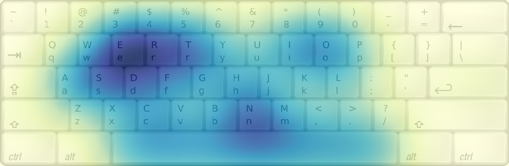

# Keyboard Heatmap

This project helps create heatmap of keys in keyboard for some given text.

Supports Nepali `नेपाली` keyboard layout, the popular `बकमान` for now and the usual `qwerty` layout.

# Installation
Clone the repository
```
git clone https://github.com/pranphy/KeyboardHeatmap
cd KeyboardHeatmap
python3 setup.py install
```
You will find an executable `kbhmap` in your path. 
# Usage

`kbhmap --help` shows the following


```
Usage: kbhmap [OPTIONS]

  a tool to generate the keyboard heatmap. It reads the text from  the input
  file and generates the heatmap. The heatmap can be configured.  The output
  heatmap image is saved in a file with name passed  as the `output`
  parameter. The smoothness of the heatmap can be controlld with `-s
  --sigma` option. The resolution of th output image can be set with `-d
  --dpi` parameter.

Options:
  -i, --input TEXT                input file name
  -o, --output TEXT               output file name
  -l, --layout [qwerty|bakamana]  keyboard layout to use
  -s, --sigma FLOAT               sigma value to smoothen heatmap
  -c, --cmap TEXT                 colormap to use
  -d, --dpi INTEGER               dpi of resulting image
  --help                          Show this message and exit.
```

# Example

See [notebook](./test/MakeHeatmap.ipynb) for usage example

# Outputs
Example heatmap for QWERTY



Example heatmap for बकमान 

